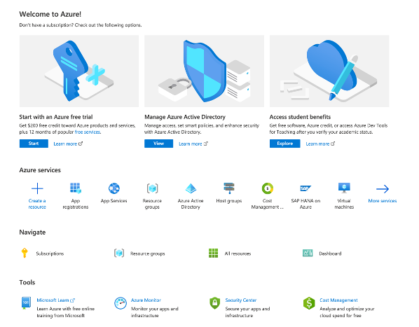
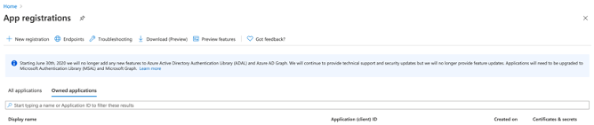
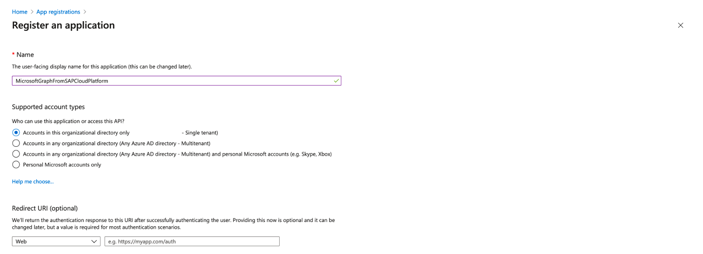
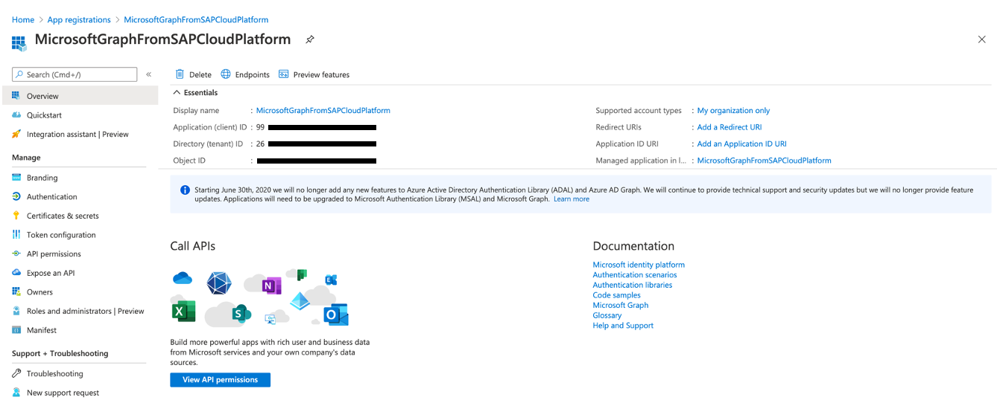

# Microsoft Graph API configuration in Microsoft Azure
On this page you will find the information to configure Microsoft Graph API in Microsoft Azure to needed for the node module: @sapmentors/cds-scp-api.

## Microsoft Azure Portal 
1. We access Microsoft Azure Portal using https://portal.azure.com/

   

## Application Registration 
2. On the Azure portal welcome we click App Registrations to start the flow for the registerprocess of our Microsoft Graph API application

   

3. Next we click New Registration

   

4. After we click Registrer, we will see the application overview page

   

   On this page the **Application (client) ID** and the **Directory (tenant) ID** are important. The **Application (client) ID** will be used as **Client ID** in the SAP Cloud Platform Destination Configuration and the **Directory (tenant) ID** is part of the **Token Service URL**

Under construction