# Microsoft Graph API configuration in Microsoft Azure
On this page, you will find the information to configure Microsoft Graph API in Microsoft Azure to be needed for the node module: @sapmentors/cds-scp-api.

## Microsoft Azure Portal 
1. Access the Microsoft Azure Portal by starting the URL https://portal.azure.com/ in your browser

   

## Application Registration 
2. On the Azure portal welcome page, click [App Registrations] to start the App registration flow for our Microsoft Graph API application

   

3. Next, click the [+ New Registration] button

   

4. After clicking the button [Register] button below, the page will redirect you to the overview page of our new application

   

   **Remark**
   - On this page, the **Application (client) ID** and the **Directory (tenant) ID** are essential.
   - The SAP Cloud Platform Destination Configuration will use the **Application (client) ID** as the **Client ID** and the **Directory (tenant) ID** as part of the **Token Service URL**

   ```text
   -----------------------------------------------------------------------------------------------
   SAP Cloud Platform Destination Settings
   -----------------------------------------------------------------------------------------------
   Client ID         : <Application client ID of Azure App>
   Token Service URL : https://login.microsoftonline.com/<Directory Tenant ID of Azure App>/oauth2/v2.0/token
   ```

## Application Authentication 
5. Next, click [Authentication] in the left menu below Manage. The Application Authentication overview page shows up.

   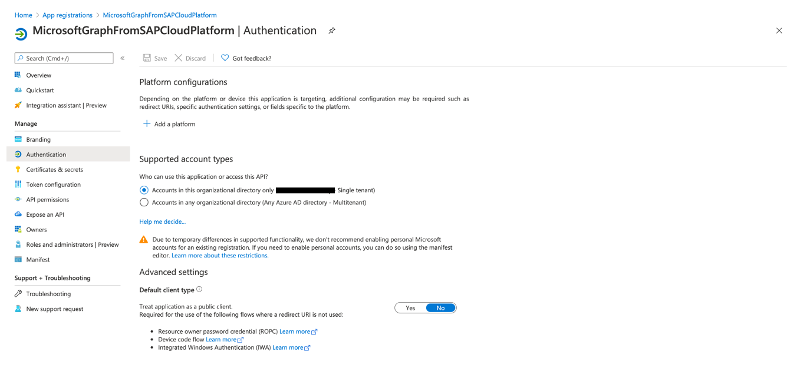

6. Click the [+ Add a Platform] button and choose [Web] tile under Web applications

   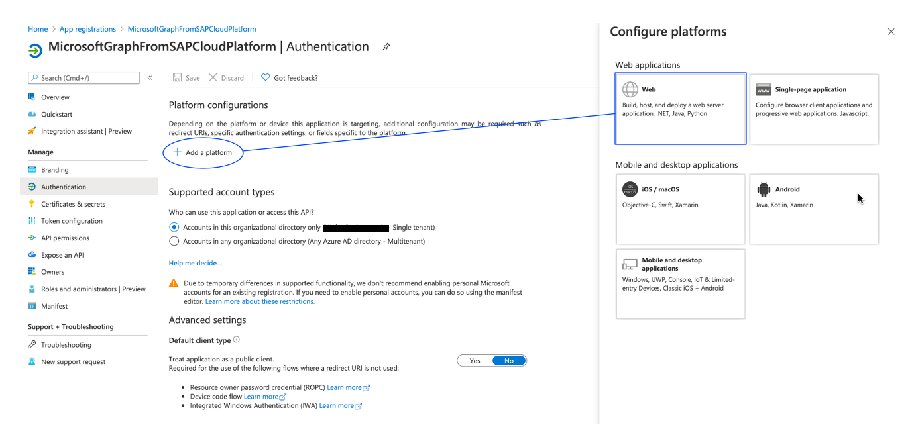


7. Now you need to config the Web settings. For the Redirect URI, you fill-in a dummy address, and you mark [v] the ID tokens under Implicit grant.

   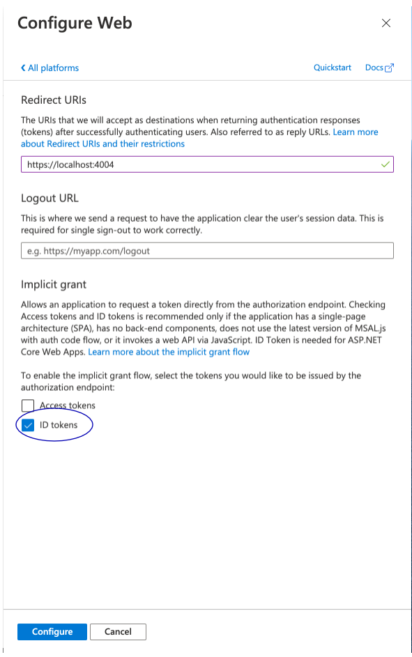

8. After clicking [Configure], you will be redirected back to the Application Authentication overview page, and the page shows the added Web platform and implicit grant setting.

   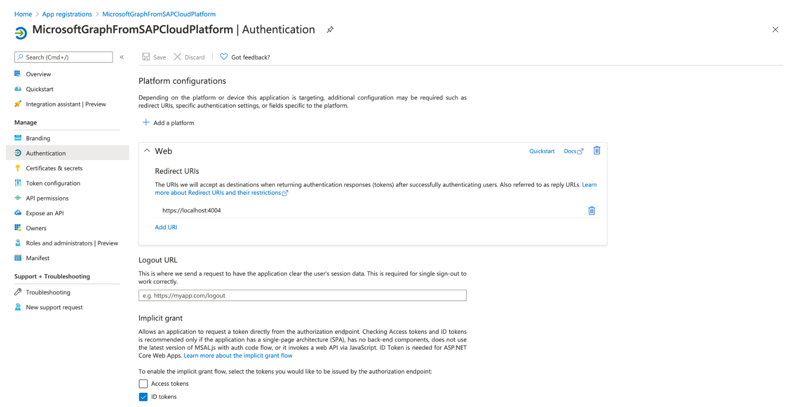

## Application Certificates and secrets
9. Next, click [Certificates and secrets] in the left menu below Manage. The Application Certificates and secrets overview page shows up.

   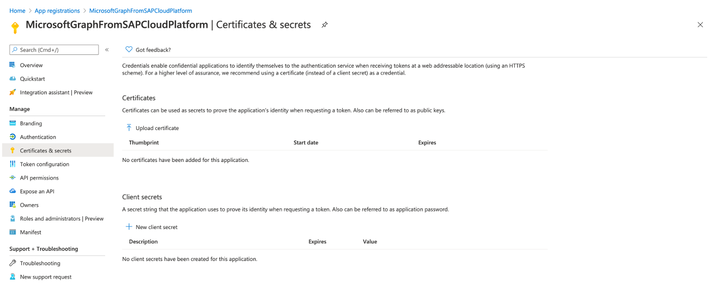

10. Click the [+ New client secret] button, give it a name, and choose the expiration time

    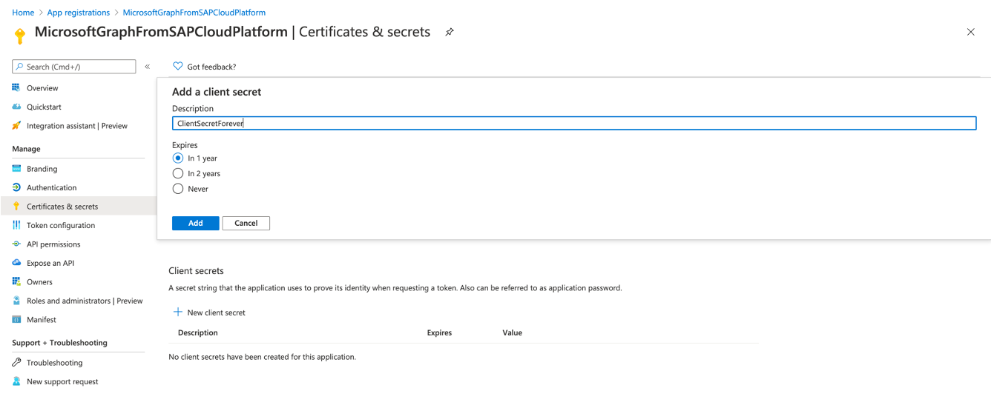

11. Click the [Add] button, and the new Client Secret value is shown.

    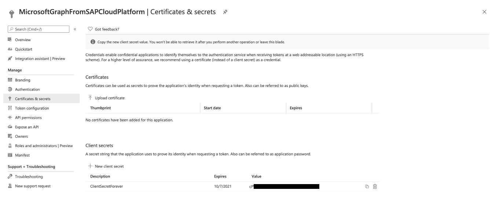

    **Remark**
    - Write down the Client Secret value in a safe place. It is the only moment this client secret value id showed
    - The SAP Cloud Platform Destination Settings uses this client secret value as Client Secret 

    ```text
    -----------------------------------------------------------------------------------------------
    SAP Cloud Platform Destination Settings
    -----------------------------------------------------------------------------------------------
    Client Secret     : <Clients Secrets Value of Azure App>
    ```

## Application API Permissions
12. Click [API permissions] button in the left menu below Manage. It shows an overview of the **Application API Permissions**.

    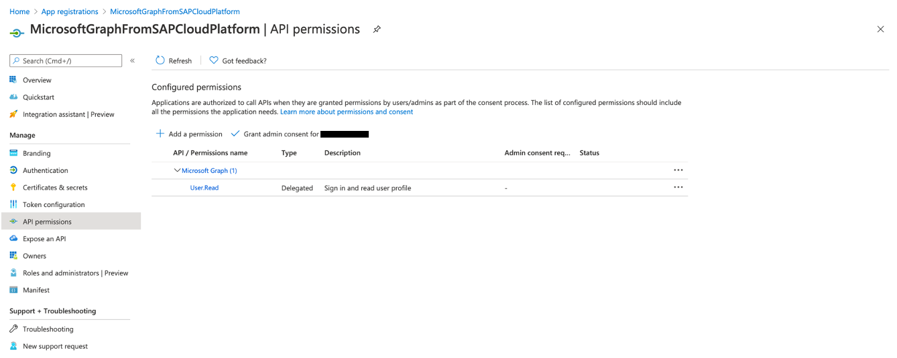

13. Click on the [+ Add a permission] button to start the permission creation flow. Next, choose the Microsoft Graph tile.

    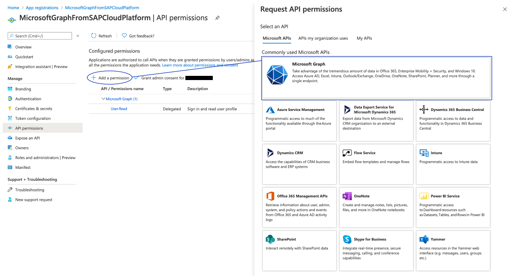

14. Next, click the [Application permissions] tile

    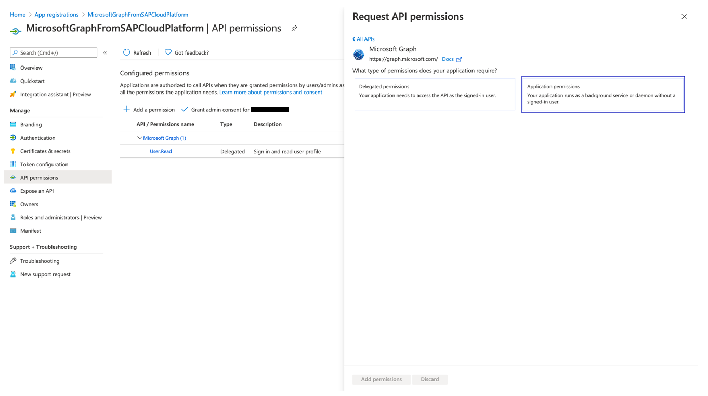

15. Search for the needed permission and mark them; We will search for the ***User.Read*** permissions and mark **User.Read.All** in our case.

    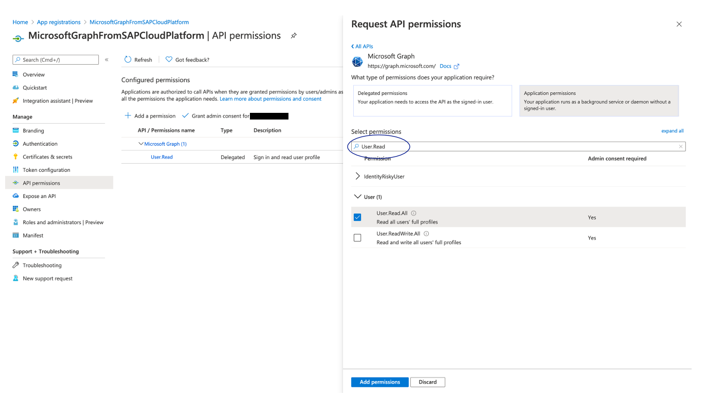

16. After clicking [Add permissions], the page will redirect you to the **Application API Permissions Overview** page again, and the new permissions are added to the list

    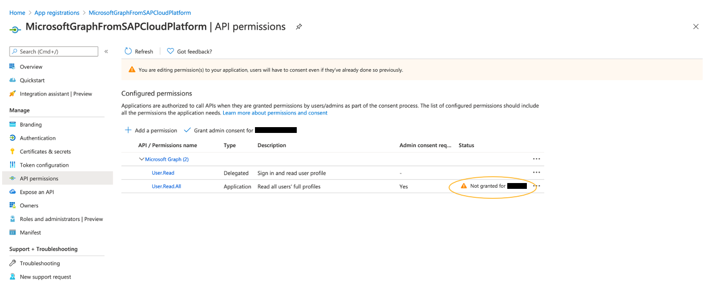

    **Remark**
    - The page shows a warning that the permissions aren't granted for your organization. 

17. We will fix this warning, clicking the [+ Add grant consent for your organisation] button. A popup shows a question to confirm this grant consent.

    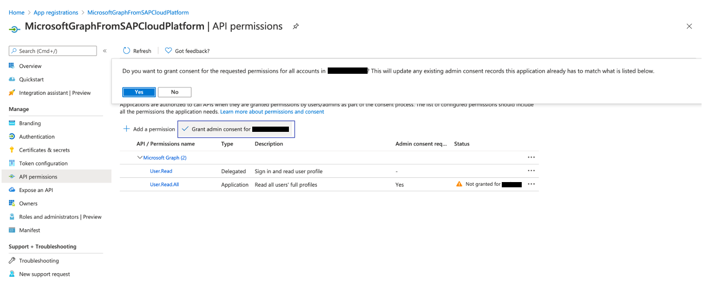

18. After clicking [Yes] the API permissions are successfully updated, and the permissions are set for the API 

    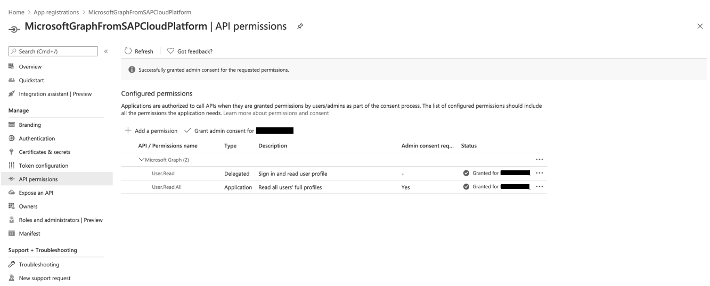

## Application API Endpoint
19. You are almost finished. You only need the endpoint of the Token Service URL. It can be found by clicking [Endpoint] on the Application Overview page and writing down the OAuth 2.0 token endpoint(v2).

    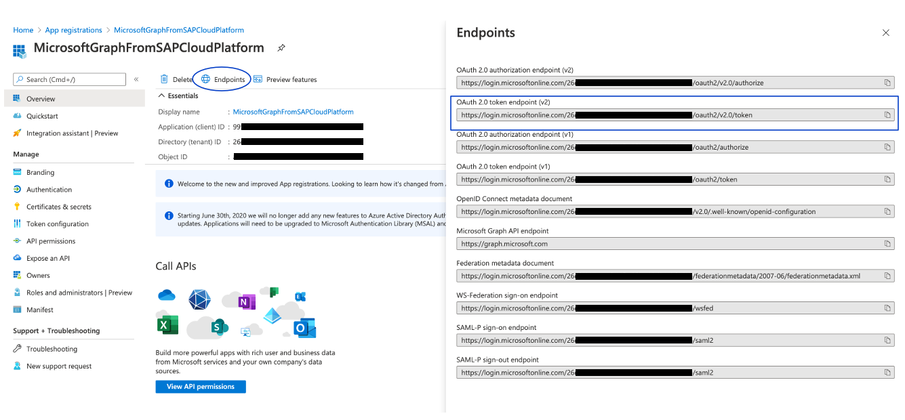

    ```text
    -----------------------------------------------------------------------------------------------
    SAP Cloud Platform Destination Settings
    -----------------------------------------------------------------------------------------------
    Token Service URL : <Application OAuth 2.0 token Endpoint(v2) of Azure App>
    ```

Now the configuration of Microsoft 365 settings is finished, and you can configure an SAP Cloud Platform Destination for Microsoft Graph.