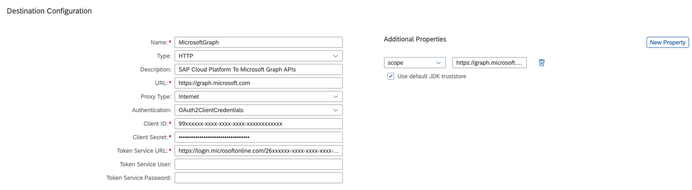

# CDS-SCP-API Node Module Example

## SAP Cloud Platform Internet Destinations for Microsoft 365 (including Azure and Office 365 APIs) 
This example uses Microsoft Graph API for reading all users' full profiles. 
- The setup of Microsoft Azure for this module can be found [here](AzureMSGraphConfiguration.md)
- Information about the API can be found at [Microsoft Graph REST API v1.0 documentation](https://docs.microsoft.com/en-us/graph/api/user-list?view=graph-rest-1.0&tabs=http).

## Microsoft 365 Examples
- [Read user list from Microsoft Azure Active Directory](../examples/InternetProxy/ReadUserlistOfAzureActiveDirectoryWithClientCredentialsAuthentication.js) - Standalone Node.js/Javascript Example

- [Provide user list from Microsoft Azure Active Directory as CAP CDS External Service](../examples/CAP/CapMSGraphCdsService.md) - Cloud Application Model Example

## Destination Configuration in SAP Cloud Platform Destination Service 



```text
URL               : https://graph.microsoft.com
Client ID         : <Application client ID of Azure App>
Client Secret     : <Clients Secrets Value of Azure App>
Token Service URL : https://login.microsoftonline.com/<Directory Tenant ID of Azure App>/oauth2/v2.0/token
                    or <Token Service URL : <Application OAuth 2.0 token Endpoint(v2) of Azure App>
Scope             : https://graph.microsoft.com/.default
```
## Javascript/Node.js Code
```javascript
const cdsapi = require("@sapmentors/cds-scp-api");

async function InternetAPIGetRequestforMicrosoft365() {
	const service = await cdsapi.connect.to("MicrosoftGraph");
	return await service.run({
		url: "/v1.0/users?$select=displayName,givenName,postalCode",
		method: 'GET'
	})
}

InternetAPIGetRequestforMicrosoft365()
	.then((data) => {
		console.log(data.value[0].displayName)
	})
```
## Output Javascript/Node.js Code (in our case)
```javascript
Robert Eijpe
```