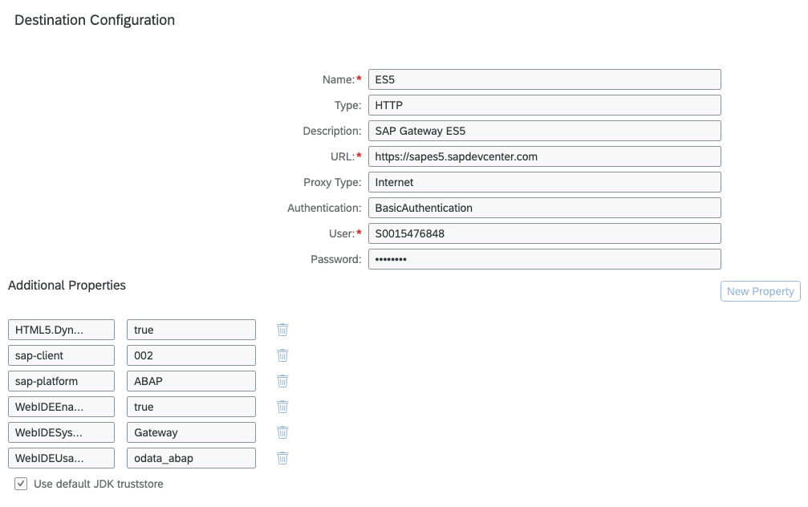

# CDS-SCP-API Node Module Example

## SAP Cloud Platform Internet Destinations with Basic Authentication 
This example is based on an API (OData Service) of SAP Gateway Demo System ES5.
To use this example, you need to follow the steps in [tutorial] (https://developers.sap.com/tutorials/gateway-demo-signup.html) to get access to ES5.

### Destination Configuration in SAP Cloud Platform Destination Service



## Javascript/Node.js Code
```javascript
const cdsapi = require("@sapmentors/cds-scp-api");

async function InternetAPIGetRequestwithBasicAuthentication() {
	const service = await cdsapi.connect.to("ES5");
	return await service.run({
		url: "/sap/opu/odata/sap/EPM_REF_APPS_SHOP_SRV/Products?$top=2"
	})
}
	
InternetAPIGetRequestwithBasicAuthentication()
	.then((data) => {
		console.log(data.d.results[0].Name)
	})
```
## Output Javascript/Node.js Code
```javascript
'Notebook Basic 15'
```