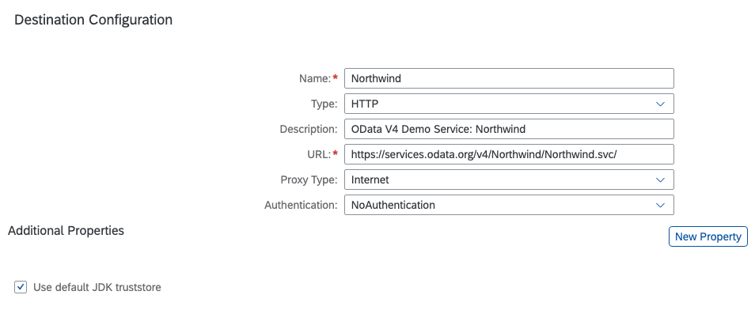

# CDS-SCP-API Node Module Example

## SAP Cloud Platform Internet Destinations with No Authorization 

### Destination Configuration in SAP Cloud Platform Destination Service



## Javascript/Node.js Code
```javascript
const cdsapi = require("@sapmentors/cds-scp-api");

async function InternetAPIGetRequestwithNoAuthorization() {
	const service = await cdsapi.connect.to("Northwind");
	// HTTP GET request based on Axios
	return await service.run({
		url: "/Products?$top=2",
		header: {
			'content-type': 'application/json'
		},
		transformResponse: ((data) => {
			return (data)
		})
	})
}

InternetAPIGetRequestwithNoAuthorization()
	.then((data) => {
        let result = JSON.parse(data)
		console.log(result.value[0].ProductName)
	})
```
## Output Javascript/Node.js Code
```javascript
Chai
```