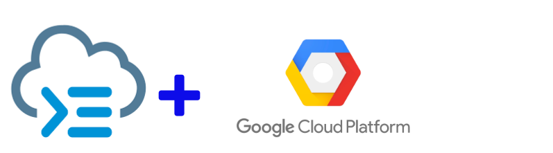
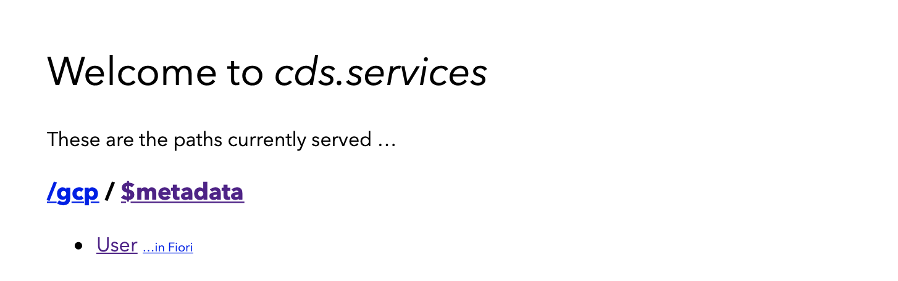

# CDS-SCP-API CAP Examples



## Prerequisites

Before you can start this example, you need to setup your environment in Google Cloud Platform and the SAP Cloud Platform Destination services as written on this [page](../../docs/InternetAPIforGCP.md).

## Userlist from Google Cloud Platform Directory Service as CAP CDS External Service

- Create a new folder and enter the new folder
  ```unix
  mkdir <cds-gcp-example-folder>
  cd <cds-gcp-example-folder>
  ```

- Initialize as CAP CDS project
  ```unix
  cds init
  ```

- Add cds-scp-api dependencies in the **package.json** file 
  ```json
  "dependencies": {
    ...
    "@sapmentors/cds-scp-api": "latest"
   },
   ```

- install the node packages by running 
  ```unix
  npm install
  ```

- add a file named **gcp-user-service.cds** with the following cds definition in the **srv** folder 
  ```javascript
  @impl:'gcp-user-service.js'
  @cds.query.limit: 100
  service GCPService @(requires:'any'){
    
    @cds.persistence.skip
    entity User {
      key email   : String;
      username    : String;
      displayName : String;
      givenName   : String;
      surname     : String;
      isGoogleDirectory:Boolean;
      } 
  }
  ```

- add a file named **gcp-user-service.js** with the following cds definition in the **srv** folder. 
  ```javascript
  const cdsapi = require("@sapmentors/cds-scp-api");
  const readFunction = async (req) => {
      console.log(req.user);

      var destination = 'GCP_API'
      const domain = '<your registered domain>'  
      const url = `/admin/directory/v1/users?domain=${domain}`
      const service = await cdsapi.connect.to(destination);
      console.log(service)
    const gcpUser = await service.run({
      url: url
    }).catch(error => {
          console.log(error)
      })

      let users = []
      users = gcpUser.users.map(gcpUser => {
          var user = {};
          user.gcp_id = gcpUser.id;
          user.username = gcpUser.primaryEmail;
          user.displayName = gcpUser.name.fullName;
          user.givenName = gcpUser.name.givenName;
          user.surname = gcpUser.name.familyName;
          user.isGoogleDirectory = true;
          return user;
      });
      return users;
  };

  module.exports = (srv) => {
      console.log(srv);
      srv.on('READ', 'User', readFunction);
  };
  ```

  Remark: Replace the **<your registered domain>** in the code with your own registered domain in Google Cloud 

- create a **default-env.json** file as described in the [prerequisites](../readme.md) for running examples locally

- Start CDS watch and open localhost:4004 in your browser
  ```unix
  cds watch
  ```
  
- Click on User to see the data from Google
