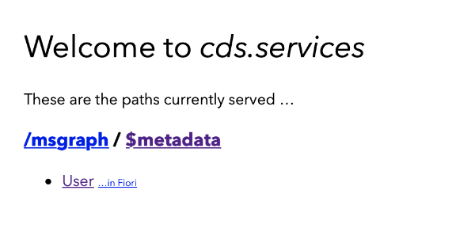

# CDS-SCP-API CAP Examples

## Userlist from Microsoft Azure Active Directory as CAP CDS External Service

- Create a new folder and enter the new folder
  ```unix
  mkdir <cds-azure-example-folder>
  cd <cds-azure-example-folder>
  ```

- Initialize as CAP CDS project
  ```unix
  cds init
  ```

- Add cds-scp-api dependencies in the **package.json** file 
  ```json
  "dependencies": {
    ...
    "@sapmentors/cds-scp-api": "^0.0.2-alpha"
   },
   ```

- install the node packages by running 
  ```unix
  npm install
  ```

- add a file named **msgraph-user-service.cds** with the following cds definition in the **srv** folder 
  ```javascript
  @impl:'msgraph-user-service.js'
  @cds.query.limit: 100
  service MSGraphService @(requires:'any'){ 
    @cds.persistence.skip
    entity User {
        key aad_id                 : String;
            username               : String;
            displayName            : String;
            givenName              : String;
            surname                : String;
            isAzureActiveDirectory : Boolean;
    } 
  }
  ```

- add a file named **msgraph-user-service.js** with the following cds definition in the **srv** folder 
  ```javascript
    const cdsapi = require("@sapmentors/cds-scp-api");
    const readFunction = async (req) => {
        let destination = 'MSGraph'
        const url = `/v1.0/users/`

        const service = await cdsapi.connect.to(destination);
        const graphUser = await service.run({
            url: url
        })
        
        let users = graphUser.value.map(graph_user => {
            var user = {}
            user.aad_id = graph_user.id
            user.username = graph_user.userPrincipalName
            user.displayName = graph_user.displayName
            user.givenName = graph_user.givenName
            user.surname = graph_user.surname
            user.isAzureActiveDirectory = true
            return user
        })
        return users
    }

    module.exports = (srv) => {
        srv.on('READ', 'User', readFunction)
    }
  ```

- create a **default-env.json** file as described in the [prerequisites](../readme.md) for running examples locally

- Start CDS watch and open localhost:4004 in your browser
  ```unix
  cds watch
  ```
  
- Click on User to see the data from Azure


## Optimize CAP CDS External Service from Microsoft 365 MSGraph Services

Microsoft Graph Services are, just like CAP Services, based on OData Version 4. So, we can optimize the **msgraph-user-service.js** code by adding these OData features. If you replace the **msgraph-user-service.js** code with the code you can find [here](./msgraph-user-service.js), the CAP CDS External Service will also support 
- access single entities by specifying the key
- $filter support
- $top support

Fill free to optimize the code and share the results with us.